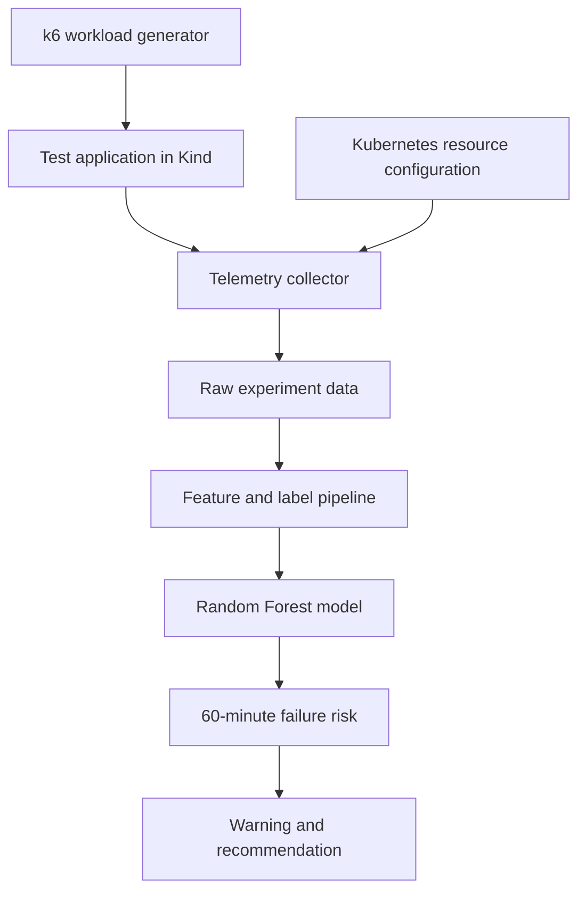

# Random Forest–Based Prediction of Resource-Configuration-Induced Kubernetes Pod Failures

## A 60-Minute Early-Warning Approach

This repository contains the code, Kubernetes manifests, experiment scripts, dataset pipeline, Random Forest model, and evaluation evidence developed for a seminar on solving industry problems through IT management.

The project investigates whether Kubernetes resource configuration, workload intensity, and runtime telemetry can be used to predict whether a pod will experience resource-related degradation or failure within the following 60 minutes.

> **Status:** Seminar proof of concept. This project is designed for controlled local experimentation and is not a production-ready Kubernetes remediation system.

## Industry Problem

Organisations increasingly use Kubernetes to operate customer-facing and business-critical services. CPU and memory configuration changes may appear safe during idle operation but become inadequate during peak workloads. The resulting conditions may include:

- container termination reported as `OOMKilled`;
- sustained CPU throttling;
- increased response latency;
- readiness failure; and
- repeated container restarts.

Kubernetes can restart failed containers, and monitoring systems can alert when predefined thresholds are crossed. These approaches are useful but are mainly reactive or context-limited. This project evaluates whether a Random Forest classifier can combine configuration, workload, and runtime indicators to provide earlier warning.

## Research Question

> How effectively can a Random Forest model use configuration, workload, and runtime indicators to predict resource-configuration-induced Kubernetes pod failures within a 60-minute horizon?

## Objectives

1. Reproduce healthy and resource-misconfigured workloads in a local Kind cluster.
2. Collect CPU, memory, workload, latency, readiness, restart, and termination data.
3. Construct labels indicating whether failure occurs within 60 minutes.
4. Train a Random Forest classifier on the experimental data.
5. Compare the model with static CPU and memory threshold monitoring.
6. Evaluate precision, recall, F1-score, false warnings, missed failures, and warning lead time.
7. Provide reproducible code, data definitions, experiment evidence, and limitations.

## Experimental Scope

The experiment uses one containerised Python web application and four controlled scenarios.

| Scenario | Resource configuration | Workload | Expected outcome |
|---|---|---|---|
| Healthy idle | Appropriate CPU and memory limits | Low | Stable operation |
| Healthy peak | Appropriate CPU and memory limits | High | Increased utilisation without failure |
| Memory failure | Inadequate memory limit | Peak or increasing | `OOMKilled` |
| CPU degradation | Inadequate CPU limit | Peak | CPU throttling and sustained latency |

The project does not attempt to predict network partitions, storage failures, database outages, security incidents, destructive administrative operations, or every possible Kubernetes failure.

## Failure Definition

An observation is labelled `1` when at least one of the following occurs within the next 60 minutes:

- the container is terminated as `OOMKilled`;
- a resource-related container restart occurs;
- readiness failure persists for at least two minutes; or
- response latency remains above the predefined degradation threshold for at least five minutes.

Otherwise, the observation is labelled `0`.

The 60-minute horizon is a classification window. It does not imply that every failure can be predicted exactly one hour before it happens.

## System Architecture



## Technology Stack

- Docker Desktop or Docker Engine
- Kind
- Kubernetes and `kubectl`
- Python 3
- Flask and Gunicorn
- k6
- Pandas and NumPy
- Scikit-learn
- Joblib
- Matplotlib and Seaborn
- Git and GitHub

Exact versions used in the experiment should be recorded in `evidence/environment.txt`.

## Repository Structure

```text
.
├── README.md
├── requirements.txt
├── application/
│   ├── app.py
│   ├── Dockerfile
│   └── requirements.txt
├── kind/
│   └── cluster.yaml
├── kubernetes/
│   └── application.yaml
├── load-tests/
│   └── workload.js
├── experiments/
│   ├── collect_metrics.py
│   ├── run_experiment.sh
│   └── reset_environment.sh
├── data/
│   ├── raw/
│   ├── processed/
│   └── data_dictionary.md
├── model/
│   ├── prepare_data.py
│   ├── train.py
│   ├── evaluate.py
│   ├── predict.py
│   └── saved/
├── results/
├── evidence/
└── docs/
    └── final-experiment-protocol.md
```

Some files and directories are populated progressively as the controlled experiments are completed.

## Prerequisites

Confirm that the required tools are installed:

```bash
docker version
kind version
kubectl version --client
python3 --version
k6 version
git --version
```

Confirm that Docker can start a container:

```bash
docker run --rm hello-world
```

For Docker Desktop, allocate at least four CPU cores, 8 GB of memory, and sufficient free disk space for cluster images and experiment data.

## Quick Start

### 1. Create the Kind cluster

If `kind/cluster.yaml` is present:

```bash
kind create cluster --config kind/cluster.yaml
```

Otherwise, create a default cluster:

```bash
kind create cluster --name seminar-lab
```

Confirm access:

```bash
kubectl cluster-info
kubectl get nodes -o wide
```

### 2. Build the test application

```bash
docker build -t predictive-app:v1 application/
```

### 3. Load the image into Kind

For a cluster named `seminar-lab`:

```bash
kind load docker-image predictive-app:v1 --name seminar-lab
```

Replace `seminar-lab` with the output of `kind get clusters` when using a different cluster name.

### 4. Deploy the application

```bash
kubectl apply -f kubernetes/application.yaml
kubectl rollout status deployment/predictive-app \
  -n seminar \
  --timeout=120s
```

Confirm the workload:

```bash
kubectl get pods,service -n seminar -o wide
```

### 5. Access the application

Run this in a separate terminal:

```bash
kubectl port-forward \
  -n seminar \
  service/predictive-app \
  8080:8080
```

Test the endpoints:

```bash
curl http://localhost:8080/health
curl http://localhost:8080/work
```

### 6. Run a short workload test

```bash
RATE=1 DURATION=1m \
k6 run load-tests/workload.js
```

## Resource Configurations

The following are pilot starting values. The final values must be established through calibration and recorded in `docs/final-experiment-protocol.md`.

### Healthy configuration

```bash
kubectl set resources deployment/predictive-app \
  -n seminar \
  --requests=cpu=100m,memory=64Mi \
  --limits=cpu=500m,memory=256Mi

kubectl set env deployment/predictive-app \
  -n seminar \
  LEAK_KB_PER_REQUEST=0 \
  CPU_WORK_MS=10
```

### Pilot memory-failure configuration

```bash
kubectl set resources deployment/predictive-app \
  -n seminar \
  --requests=cpu=100m,memory=32Mi \
  --limits=cpu=500m,memory=64Mi

kubectl set env deployment/predictive-app \
  -n seminar \
  LEAK_KB_PER_REQUEST=128 \
  CPU_WORK_MS=10
```

Confirm an OOM termination after the experiment:

```bash
POD_NAME=$(kubectl get pods \
  -n seminar \
  -l app=predictive-app \
  -o jsonpath='{.items[0].metadata.name}')

kubectl get pod "$POD_NAME" \
  -n seminar \
  -o jsonpath='{.status.containerStatuses[0].lastState.terminated.reason}{"\n"}'
```

The required result is `OOMKilled`.

### Pilot CPU-degradation configuration

```bash
kubectl set resources deployment/predictive-app \
  -n seminar \
  --requests=cpu=25m,memory=64Mi \
  --limits=cpu=50m,memory=256Mi

kubectl set env deployment/predictive-app \
  -n seminar \
  LEAK_KB_PER_REQUEST=0 \
  CPU_WORK_MS=50
```

CPU throttling can be inspected through cgroup statistics:

```bash
POD_NAME=$(kubectl get pods \
  -n seminar \
  -l app=predictive-app \
  -o jsonpath='{.items[0].metadata.name}')

kubectl exec -n seminar "$POD_NAME" -- \
  cat /sys/fs/cgroup/cpu.stat
```

Compare `nr_throttled` and `throttled_usec` before and after the workload.

## Experimental Protocol

Each experiment should:

1. Restore a known configuration.
2. Wait for the deployment rollout to complete.
3. Assign a unique `experiment_id`.
4. Start the telemetry collector.
5. Start the selected k6 workload.
6. Collect observations once per minute.
7. Record Kubernetes events, readiness, restarts, and termination state.
8. Store k6 output and Kubernetes telemetry separately.
9. Stop after the defined duration or confirmed failure.
10. Preserve the raw data before preprocessing.

Recommended proof-of-concept repetitions:

| Scenario | Runs |
|---|---:|
| Healthy idle | 3 |
| Healthy peak | 3 |
| Memory failure | 3 |
| CPU degradation | 3 |
| **Total** | **12** |

Healthy negative runs must be observed for the complete 60-minute window. Failure runs may end after failure evidence is captured.

## Data Dictionary

The processed dataset should contain at least:

| Field | Description |
|---|---|
| `experiment_id` | Unique experimental run identifier |
| `timestamp` | Observation time |
| `memory_limit_mb` | Configured container memory limit |
| `cpu_limit_millicores` | Configured container CPU limit |
| `memory_utilisation_pct` | Memory usage relative to the configured limit |
| `memory_growth_mb_min` | Change in memory usage per minute |
| `cpu_utilisation_pct` | Estimated CPU utilisation |
| `cpu_throttling_ratio` | Proportion of observed CPU time affected by throttling |
| `request_rate` | Requests processed per second |
| `response_latency_ms` | End-to-end request latency |
| `workload_state` | Idle or peak |
| `restart_count` | Current container restart count |
| `ready` | Pod readiness condition |
| `failure_type` | Healthy, OOMKilled, or CPU degradation |
| `failure_within_60m` | Binary target label |

See `data/data_dictionary.md` for the final types, units, sources, and validation rules.

## Feature Engineering

The model uses only information available at prediction time. Post-failure termination reasons, future restart counts, and failure timestamps must not be included as predictors.

Key derived features include:

```text
memory_utilisation_pct = memory_usage_mb / memory_limit_mb * 100
memory_growth_mb_min = change_in_memory_usage / elapsed_minutes
```

Where available, CPU throttling is derived from changes in cgroup `cpu.stat` values between consecutive observations.

## Dataset Splitting

Complete experimental runs must be assigned to training, validation, or testing. Rows from the same experiment must not be randomly distributed across different partitions because this would cause data leakage.

For 12 exploratory runs, an initial split is:

- Training: 8 runs
- Validation: 2 runs
- Testing: 2 runs

The test partition must contain healthy and failed outcomes. The small number of independent experiments must be acknowledged when interpreting results.

## Model Training

Install project dependencies:

```bash
python3 -m venv .venv
source .venv/bin/activate
pip install -r requirements.txt
```

Prepare the data:

```bash
python model/prepare_data.py
```

Train the model:

```bash
python model/train.py
```

Evaluate the model:

```bash
python model/evaluate.py
```

Generate a prediction:

```bash
python model/predict.py --input data/processed/sample_prediction.csv
```

Commands become operational as their corresponding scripts are implemented.

## Initial Random Forest Configuration

```python
RandomForestClassifier(
    n_estimators=300,
    max_depth=12,
    min_samples_leaf=3,
    class_weight="balanced",
    random_state=42,
    n_jobs=-1,
)
```

Hyperparameters must be tuned using validation experiments only. Final evaluation must be performed once on the untouched test experiments.

## Static-Threshold Baseline

The Random Forest model is compared with a conventional baseline.

Example memory rule:

```text
memory utilisation >= 85%
```

Example CPU rule:

```text
CPU throttling is sustained
AND latency exceeds the fixed degradation threshold
```

The final thresholds must be fixed before examining test-set outcomes.

## Evaluation Metrics

The project reports:

- precision;
- recall;
- F1-score;
- precision-recall area under the curve, where appropriate;
- false warnings;
- missed failures;
- first correct warning time;
- sustained warning lead time; and
- model inference latency.

Accuracy is not used as the principal measure because healthy observations may outnumber failure observations.

## Expected Outputs

The `results/` directory should contain:

- `metrics.json`;
- confusion matrix;
- feature-importance chart;
- memory behaviour chart;
- CPU throttling and latency chart;
- warning lead-time summary;
- static-threshold comparison; and
- experiment summary.

Only genuine experimental outputs should be committed. Model-performance values must not be invented or inferred from incomplete runs.

## Reproducibility Evidence

The `evidence/` directory should contain:

- environment and tool versions;
- cluster and node information;
- applied deployment configurations;
- pod descriptions;
- Kubernetes events;
- confirmed `OOMKilled` status;
- CPU-throttling observations; and
- experiment start and completion records.

Do not commit kubeconfig files, passwords, access tokens, personal data, or private organisational information.

## Preventive Recommendations

The proof of concept provides recommendations rather than unrestricted autonomous remediation.

| Predicted condition | Recommended action |
|---|---|
| Low risk | Continue monitoring |
| Moderate risk | Extend testing or canary observation |
| High memory risk | Pause rollout and review memory allocation |
| High CPU risk | Pause rollout and review CPU allocation |
| Confirmed degradation | Roll back the resource change and investigate |

## Limitations

- Kind does not reproduce every characteristic of a production Kubernetes environment.
- The initial study uses one application and two resource-failure categories.
- Twelve experiments constitute exploratory rather than production-scale validation.
- Observations from the same experiment are temporally correlated.
- Some failures occur immediately and provide no measurable 60-minute precursor.
- Random Forest identifies statistical relationships; it does not prove causation.
- The model must not be used for unsupervised production remediation without additional validation and safeguards.

## Future Development

Potential MIT final-project extensions include:

- additional Kubernetes failure categories;
- multiple application architectures;
- managed multi-node Kubernetes environments;
- comparison with XGBoost and Logistic Regression;
- Isolation Forest for runtime anomaly detection;
- model explainability using SHAP;
- CI/CD and canary-deployment integration;
- real-time prediction API and dashboard;
- policy-controlled rollback; and
- model and data-drift monitoring.

## Academic Use

This repository accompanies a seminar paper in the area of **Solving Industry Problems through IT Management**. Results should be interpreted within the limitations of a controlled local experiment. Anyone reusing the work should cite the repository and the accompanying seminar paper.

## Author

**Okorowu Evarest Igwe**  
Master of Information Technology Seminar Project

## Licence

Add the licence approved for the project before public release. The MIT Licence is a common option for reusable source code, but dataset and institutional requirements should be confirmed separately.
