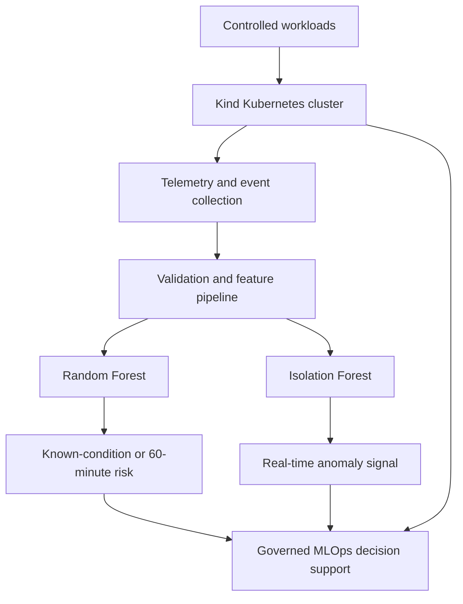

# 60-Minute Early Prediction of Kubernetes Pod and Node Failures Using Random Forest and Isolation Forest

This repository contains the Kubernetes laboratory, experiment scripts, telemetry, datasets, model outputs, and verification evidence developed for the MIT 8212 seminar project.

> **Research status:** Controlled proof of concept conducted on a local, single-node Kind cluster. The results demonstrate technical feasibility within the recorded experiments; they do not establish production-scale generalisation or authorise autonomous remediation.

## Principal Research Question

> **How can Random Forest and Isolation Forest be integrated within a unified MLOps platform to predict and detect Kubernetes pod and node failures with at least 60 minutes of actionable early warning?**

## Study Purpose

Kubernetes can restart failed containers and monitoring platforms can alert when fixed thresholds are crossed. These mechanisms are necessary, but they may identify degradation only after a predefined symptom has appeared. This study evaluates a complementary hybrid approach:

- **Random Forest** performs supervised classification of known operational conditions and focused prediction of failure within a 60-minute horizon.
- **Isolation Forest** learns healthy behaviour without failure labels and detects deviations that may provide an earlier warning.
- **Kubernetes-native evidence**—events, readiness, restarts, termination reasons, resource metrics, and workload results—remains the deterministic source for confirmation and operational governance.

The models perform different tasks. Their metrics are therefore reported separately and are not averaged into one performance score.

## Experimental Design

The work follows Design Science Research, controlled quantitative experimentation, and a CRISP-DM/MLOps lifecycle. Four analytical tasks were evaluated:

1. multiclass classification of known Kubernetes operational conditions;
2. broad anomaly detection against a validated healthy baseline;
3. binary prediction of failure within the next 60 minutes; and
4. unsupervised early warning of a controlled memory-failure trajectory.

### Recorded conditions

- healthy baseline;
- CPU stress;
- memory pressure and `OOMKilled`;
- `CrashLoopBackOff`; and
- node disruption.

Fourteen named experimental runs contributed to the complete study. The exploratory stage used healthy, CPU-stress, memory-pressure, crash-loop, and node-disruption evidence. The focused time-series stage used `TS-HB-01`, `TS-HB-02`, and `TS-MEM-01`.

### Important evidence correction

`NODE-02` was planned as a node-failure experiment, but its evidence showed 109 observations in which the pod remained Running and Ready, with no recorded outage interval. Its raw file was preserved unchanged, while the observations were transparently relabelled as healthy during analytical consolidation. It must not be presented as a successful node-disruption run.

## Datasets

| Analytical stage | Dataset | Composition | Purpose |
|---|---:|---|---|
| Exploratory | 825 validated observations | Healthy, CPU stress, memory pressure, crash loop, and node disruption | Multiclass classification and broad anomaly detection |
| Focused time series | 266 observations | 90 healthy training, 90 independent healthy holdout, and 86 memory-failure observations | 60-minute prediction and warning-lead-time evaluation |

The 266-row dataset contains 42 current, rolling, and change-based features. These include CPU, memory, and readiness values; 5-, 15-, and 30-minute rolling statistics; one-minute changes; and memory-growth rate.

Timestamps, experiment identifiers, failure timestamps, minutes to failure, and future failure-window fields were excluded from model inputs. Complete experimental runs or chronological blocks were used to reduce row-level and temporal leakage.

## Verified Results

### Exploratory evaluation

| Model | Task | Evaluation evidence | Result |
|---|---|---:|---|
| Random Forest | Five-class operational-condition classification | 278 held-out observations | 63.31% accuracy; 50.95% macro F1; 63.58% weighted F1 |
| Isolation Forest | Normal-versus-anomaly detection | 664 unseen observations | 99.12% anomaly precision; 36.87% recall; 53.75% F1; 64.64% ROC-AUC |

The exploratory Random Forest provided moderate discrimination across known conditions. Its largest confusion was between CPU stress and memory pressure. The exploratory Isolation Forest produced very reliable alerts when it flagged an anomaly, but its low recall meant that it missed many failure observations, particularly crash-loop patterns.

### Focused 60-minute evaluation

| Model | Task | Evaluation evidence | Result |
|---|---|---:|---|
| Random Forest | Binary `failure_within_60m` prediction | 82 held-out observations | 100% across reported classification metrics |
| Isolation Forest | Healthy-baseline anomaly detection and early warning | 176 evaluation observations | 80.68% accuracy; 63.44% precision; 100% recall; 77.63% F1; 88.67% ROC-AUC |

The focused Isolation Forest detected all 59 observations inside the formal failure window. Its first anomaly appeared **78.78 minutes before the recorded memory failure**, approximately 18.78 minutes before the formal 60-minute boundary. The independent healthy holdout produced a **16.67% false-positive rate**.

The focused Random Forest result is promising but preliminary. It was derived from one controlled memory-failure experiment and a chronological within-experiment split. It must not be interpreted as proof of equivalent performance across unseen applications, clusters, node failures, or other failure families.

## Model Comparison

| Dimension | Random Forest | Isolation Forest |
|---|---|---|
| Learning method | Supervised | Unsupervised |
| Training requirement | Labelled examples | Validated healthy baseline |
| Main operational role | Classify represented conditions and predict a defined target | Detect deviation without needing every failure label |
| Strongest finding | Perfect focused classification on 82 held-out rows | 100% failure-window recall and 78.78-minute first warning |
| Main limitation | Small, homogeneous focused dataset | 16.67% focused healthy false-positive rate and low exploratory recall |

Random Forest produced the stronger formal classification performance. Isolation Forest supplied distinct operational value by detecting abnormal behaviour without failure labels and establishing a verified warning timeline. The evidence supports using both as complementary decision-support signals alongside Kubernetes-native monitoring and human-governed response.

## Architecture



## Result-Verification Map

The following artifact families form the verification chain used in the seminar report:

| Evidence | Purpose |
|---|---|
| Raw experiment telemetry and workload output | Confirms what occurred during each controlled run |
| Processed exploratory and time-series datasets | Confirms row counts, labels, features, and analytical inputs |
| Random Forest evaluation summaries | Confirms confusion matrices, held-out metrics, and feature importance |
| Isolation Forest evaluation summaries | Confirms anomaly metrics, scores, experiment-level rates, and lead time |
| Test-prediction CSV files | Permits independent recalculation of reported metrics |
| Classification reports | Provides class-level precision, recall, F1-score, and support |
| SHA-256 manifests | Detects subsequent modification of checksum-verified artifacts |

The focused model evidence uses the `RF-60m-*` and `IF-*` naming conventions under `evidence/model/`. The processed time-series dataset is identified as `TS-predictive-dataset-v1.csv`.

> **Repository completeness check:** before treating this repository as a complete independent verification package, confirm that the processed datasets and all `RF-60m-*` and `IF-*` evidence files are visible on the public branch. A README result table is an index, not a substitute for the underlying artifacts.

## Verify the Evidence

### PowerShell

Run the following from the repository root:

```powershell
Get-FileHash .\evidence\model\* -Algorithm SHA256

$rf = Get-Content .\evidence\model\RF-60m-evaluation-summary-v1.json -Raw |
  ConvertFrom-Json

$features = Import-Csv .\evidence\model\RF-60m-feature-importance-v1.csv

"Model: $($rf.model_type)"
"Top-10 feature entries: $($rf.top_10_features.Count)"
"Feature rows: $($features.Count)"
"Feature-importance total: $(($features | Measure-Object importance -Sum).Sum)"
"Features absent from CSV:"
$rf.feature_columns | Where-Object { $_ -notin $features.feature }
```

Expected Random Forest audit:

- model type: `RandomForestClassifier`;
- top-10 list: 10 entries;
- feature-importance CSV: 42 rows;
- feature-importance total: 1; and
- no model feature absent from the CSV.

### Bash

```bash
sha256sum evidence/model/*

python - <<'PY'
import csv
import json
from pathlib import Path

root = Path("evidence/model")
summary = json.loads(
    (root / "RF-60m-evaluation-summary-v1.json").read_text(encoding="utf-8")
)
with (root / "RF-60m-feature-importance-v1.csv").open(
    encoding="utf-8", newline=""
) as handle:
    rows = list(csv.DictReader(handle))

csv_features = {row["feature"] for row in rows}
print("Model:", summary["model_type"])
print("Top-10 feature entries:", len(summary["top_10_features"]))
print("Feature rows:", len(rows))
print("Feature-importance total:", sum(float(row["importance"]) for row in rows))
print(
    "Features absent from CSV:",
    [name for name in summary["feature_columns"] if name not in csv_features],
)
PY
```

Evaluation metrics can be independently recalculated from the preserved test-prediction files with scikit-learn. Use the same positive-class definitions recorded in each evaluation summary: supervised failure for Random Forest and anomaly/failure-window membership for Isolation Forest.

## Reproduction Workflow

1. Record Docker, Kind, Kubernetes, Python, k6, and package versions.
2. Create the Kind cluster and deploy the test application.
3. Restore the declared configuration before each run.
4. Execute the selected workload and failure scenario.
5. Collect Kubernetes, cgroup, application, and k6 evidence at the defined interval.
6. Preserve raw files before cleaning or feature engineering.
7. Build the exploratory or focused dataset.
8. Train Random Forest and Isolation Forest using their separate pipelines.
9. Evaluate only on the declared held-out data.
10. export predictions, reports, figures, summaries, and SHA-256 manifests.

## Quick Start

Confirm the required tools:

```bash
docker version
kind version
kubectl version --client
python3 --version
k6 version
git --version
```

Create the cluster:

```bash
kind create cluster --config kind/cluster.yaml
kubectl cluster-info
kubectl get nodes -o wide
```

Build and load the application:

```bash
docker build -t predictive-app:v1 application/
kind load docker-image predictive-app:v1 --name seminar-lab
```

Deploy and verify:

```bash
kubectl apply -f kubernetes/application.yaml
kubectl rollout status deployment/predictive-app -n seminar --timeout=120s
kubectl get pods,service -n seminar -o wide
```

Install the Python environment:

```bash
python3 -m venv .venv
source .venv/bin/activate
pip install -r requirements.txt
```

Refer to the experiment scripts and protocol documentation for scenario-specific commands. Do not run resource-exhaustion experiments against a live organisational or production system.

## Repository Structure

```text
.
├── README.md
├── application/       # Test application and container definition
├── kind/              # Local Kubernetes cluster configuration
├── kubernetes/        # Workload manifests
├── load-tests/        # k6 workload definitions
├── experiments/       # Collection, execution, and reset scripts
├── data/
│   ├── raw/           # Preserved source observations
│   └── processed/     # Validated analytical datasets
├── model/             # Feature, training, evaluation, and prediction code
├── evidence/
│   └── model/         # Reports, predictions, summaries, and checksums
├── results/           # Evaluation figures and result exports
└── docs/              # Experimental protocol and supporting documentation
```

## Limitations

- The environment was a local, single-node Kind cluster.
- Only one test application was used.
- The number of independent experiments was small relative to the row counts.
- Rows within an experiment were temporally correlated.
- The focused evaluation contained only one memory-failure trajectory.
- Only one validated node-disruption experiment was available.
- The focused Random Forest split does not prove cross-experiment generalisation.
- The focused Isolation Forest requires threshold calibration to reduce healthy false positives.
- The exploratory Isolation Forest missed many crash-loop and node-disruption observations.
- Feature importance indicates association within this dataset, not causation.
- A static-threshold baseline was not independently scored on the same final held-out evidence.

## Safe Operational Interpretation

This proof of concept provides decision support, not unrestricted autonomous remediation:

- high supervised risk plus an anomaly signal may justify escalation, rollout pause, or resource review;
- an anomaly without supervised risk should initially trigger investigation or increased observation;
- Kubernetes events, probes, and threshold alerts should remain active;
- model version, feature values, configuration change, recommendation, and operator response should be logged; and
- production use requires broader workloads, repeated failures, multi-node validation, drift monitoring, and policy safeguards.

## Academic Use

This repository accompanies a Master of Information Technology seminar paper in **Solving Industry Problems through IT Management**. Anyone reusing the code, data, or reported results should cite the repository and acknowledge the controlled proof-of-concept limitations.

## Author

**OKOROWU EVAREST IGWE**  
Master of Information Technology  
Miva Open University of Nigeria  
July 2026

## Repository

<https://github.com/evarestigwe/MIT8212-SEMINAR>

## Licence

No reusable licence is granted until a licence file is added. Confirm institutional and dataset requirements before selecting an open-source licence.
