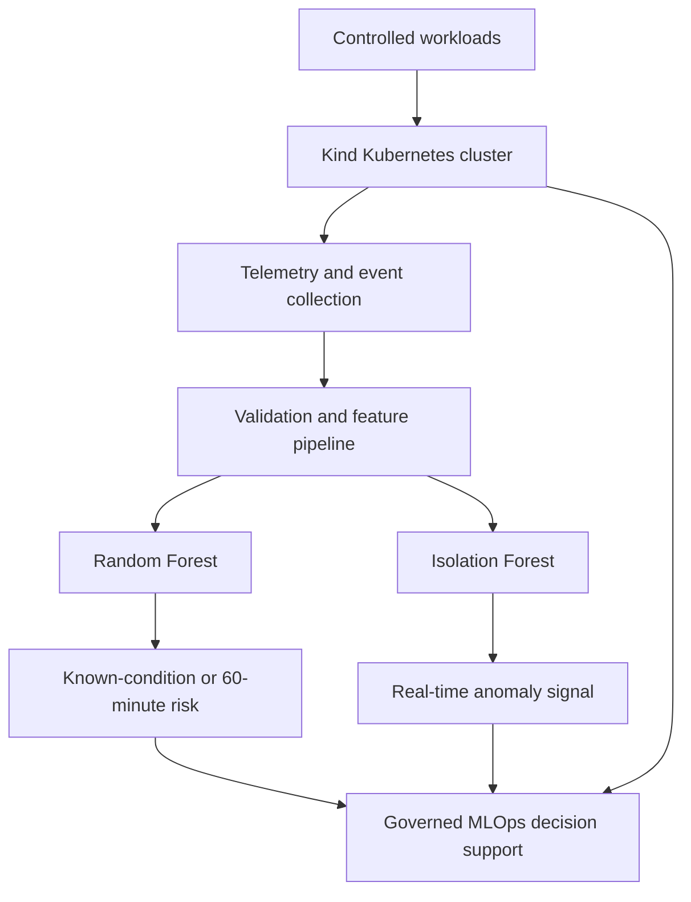

# 60-Minute Early Prediction of Kubernetes Pod and Node Failures Using Random Forest and Isolation Forest

This repository contains the Kubernetes laboratory, experiment scripts, telemetry, datasets, model outputs, and verification evidence developed for the MIT 8212 seminar project.

> **Research status:** This was a controlled proof of concept on a local, single-node Kind cluster. The findings demonstrate technical feasibility within the recorded experiments. They do not establish production-scale generalisation and do not authorise autonomous remediation.

## Principal Research Question

> **How can Random Forest and Isolation Forest be integrated within a unified MLOps platform to predict and detect Kubernetes pod and node failures with at least 60 minutes of actionable early warning?**

## Table of Contents

- [Study Purpose](#study-purpose)
- [Experimental Design](#experimental-design)
- [Datasets](#datasets)
- [Verified Results](#verified-results)
- [Model Comparison](#model-comparison)
- [Architecture](#architecture)
- [Implementation Inventory](#implementation-inventory)
- [Complete Implementation Code and Explanation](#complete-implementation-code-and-explanation)
- [Verified Modelling Specifications](#verified-modelling-specifications)
- [End-to-End Execution Guide](#end-to-end-execution-guide)
- [Result-Verification Map](#result-verification-map)
- [Verify the Evidence](#verify-the-evidence)
- [Repository Completeness and Reproducibility Status](#repository-completeness-and-reproducibility-status)
- [Limitations](#limitations)
- [Safe Operational Interpretation](#safe-operational-interpretation)

## Study Purpose

Kubernetes can restart failed containers, and monitoring platforms can alert when fixed thresholds are crossed. These mechanisms are necessary, but they may identify degradation only after a predefined symptom has appeared. This study evaluates a complementary hybrid approach:

- **Random Forest** performs supervised classification of known operational conditions and focused prediction of failure within a 60-minute horizon.
- **Isolation Forest** learns healthy behaviour without failure labels and detects deviations that may provide an earlier warning.
- **Kubernetes-native evidence**—events, readiness, restarts, termination reasons, resource metrics, and workload results—remains the deterministic source for confirmation and operational governance.

The models perform different tasks. Their metrics are reported separately and are not averaged into a single performance score.

## Experimental Design

The study follows Design Science Research, controlled quantitative experimentation, and a CRISP-DM/MLOps lifecycle. Four analytical tasks were evaluated:

1. multiclass classification of known Kubernetes operational conditions;
2. broad anomaly detection against a validated healthy baseline;
3. binary prediction of failure within the next 60 minutes; and
4. unsupervised early warning of a controlled memory-failure trajectory.

### Recorded conditions

- healthy baseline;
- CPU stress;
- memory pressure and `OOMKilled`;
- `CrashLoopBackOff`; and
- node disruption.

Fourteen named experimental runs contributed to the study. The exploratory stage used healthy, CPU-stress, memory-pressure, crash-loop, and node-disruption evidence. The focused time-series stage used `TS-HB-01`, `TS-HB-02`, and `TS-MEM-01`.

### Important evidence correction

`NODE-02` was planned as a node-failure experiment, but its evidence contained 109 observations in which the pod remained Running and Ready, with no recorded outage interval. The raw file was preserved unchanged, while the observations were transparently relabelled as healthy during analytical consolidation. `NODE-02` must not be presented as a successful node-disruption run.

## Datasets

| Analytical stage | Dataset | Composition | Purpose |
|---|---:|---|---|
| Exploratory | 825 validated observations | Healthy, CPU stress, memory pressure, crash loop, and node disruption | Multiclass classification and broad anomaly detection |
| Focused time series | 266 observations | 90 healthy training, 90 independent healthy holdout, and 86 memory-failure observations | 60-minute prediction and warning-lead-time evaluation |

The exploratory source contained 829 raw rows across 12 CSV files. Four test rows were excluded, leaving 825 validated observations: 212 healthy, 164 CPU stress, 163 memory pressure, 248 crash loop, and 38 node disruption.

The focused 266-row dataset contains 42 current, rolling, and change-based features. These include CPU, memory, and readiness values; 5-, 15-, and 30-minute rolling statistics; one-minute changes; and memory-growth rate.

Timestamps, experiment identifiers, failure timestamps, minutes to failure, and future failure-window fields were excluded from model inputs. Complete experimental runs or chronological blocks were used to reduce row-level and temporal leakage.

## Verified Results

### Exploratory evaluation

| Model | Task | Evaluation evidence | Result |
|---|---|---:|---|
| Random Forest | Five-class operational-condition classification | 278 held-out observations | 63.31% accuracy; 50.95% macro F1; 63.58% weighted F1 |
| Isolation Forest | Normal-versus-anomaly detection | 664 unseen observations | 99.12% anomaly precision; 36.87% recall; 53.75% F1; 64.64% ROC-AUC |

The exploratory Random Forest provided moderate discrimination across known conditions. Its largest confusion was between CPU stress and memory pressure. The exploratory Isolation Forest produced highly precise alerts when it flagged an anomaly, but its low recall meant that it missed many failure observations, particularly crash-loop patterns.

### Focused 60-minute evaluation

| Model | Task | Evaluation evidence | Result |
|---|---|---:|---|
| Random Forest | Binary `failure_within_60m` prediction | 82 held-out observations | 100% across reported classification metrics |
| Isolation Forest | Healthy-baseline anomaly detection and early warning | 176 evaluation observations | 80.68% accuracy; 63.44% precision; 100% recall; 77.63% F1; 88.67% ROC-AUC |

The focused Isolation Forest detected all 59 observations inside the formal failure window. Its first anomaly appeared **78.78 minutes before the recorded memory failure**, approximately 18.78 minutes before the formal 60-minute boundary. The independent healthy holdout produced a **16.67% false-positive rate**.

The focused Random Forest result is promising but preliminary. It was derived from one controlled memory-failure experiment and a chronological within-experiment split. It must not be interpreted as proof of equivalent performance across unseen applications, clusters, node failures, or other failure families.

## Model Comparison

| Dimension | Random Forest | Isolation Forest |
|---|---|---|
| Learning method | Supervised | Unsupervised |
| Training requirement | Labelled examples | Validated healthy baseline |
| Main operational role | Classify represented conditions and predict a defined target | Detect deviation without needing every failure label |
| Strongest focused finding | Perfect classification on 82 held-out rows | 100% failure-window recall and 78.78-minute first warning |
| Main limitation | Small, homogeneous focused dataset | 16.67% focused healthy false-positive rate and low exploratory recall |

Random Forest produced the stronger formal classification performance. Isolation Forest supplied different operational value by detecting abnormal behaviour without failure labels and establishing a verified warning timeline. The evidence supports using both as complementary decision-support signals alongside Kubernetes-native monitoring and human-governed response.

## Architecture



## Implementation Inventory

The following table distinguishes code that is currently present on the public branch from code specifications and evidence that are described by the research record but are not yet committed as executable source.

| Component | Public path | Public status | Purpose |
|---|---|---|---|
| Failure-injection test API | [`application/app.py`](application/app.py) | Present | Generates controllable CPU work, memory growth, and delayed container termination |
| Application dependencies | [`application/requirements.txt`](application/requirements.txt) | Present | Pins Flask and Gunicorn |
| Container image | [`application/Dockerfile`](application/Dockerfile) | Present | Packages the test API |
| Kubernetes workload | [`kubernetes/application.yaml`](kubernetes/application.yaml) | Present | Creates the namespace, Deployment, probes, resource constraints, and Service |
| k6 load generator | [`load-tests/workload.js`](load-tests/workload.js) | Present | Applies a configurable constant request-arrival rate |
| Telemetry collector | [`experiments/collect_metrics.py`](experiments/collect_metrics.py) | Present | Collects pod CPU, memory, readiness, restarts, phase, and node into CSV |
| Model dependencies | [`model/requirements.txt`](model/requirements.txt) | Present | Declares data-science, modelling, plotting, serialisation, and YAML libraries |
| Exploratory RF constructor | [`train_model.py`](train_model.py) | Present but incomplete | Instantiates the exploratory Random Forest; it does not load, fit, evaluate, or export the model |
| Kind cluster configuration | `kind/cluster.yaml` | Not present | README commands must not assume this file exists |
| Feature-engineering source | Expected under `model/` | Not present | Required to regenerate the 42-feature time-series dataset |
| Complete Random Forest pipeline | Expected under `model/` | Not present | Required to reproduce training, predictions, metrics, figures, and exports |
| Complete Isolation Forest pipeline | Expected under `model/` | Not present | Required to reproduce anomaly scores, thresholding, lead time, and exports |
| Focused processed dataset | `data/processed/TS-predictive-dataset-v1.csv` | Not confirmed on public branch | Required for focused model reruns |
| Focused evidence families | `evidence/model/RF-60m-*` and `evidence/model/IF-*` | Not confirmed on public branch | Required for independent verification of focused claims |

## Complete Implementation Code and Explanation

This section embeds every implementation file currently confirmed on the public branch. The blocks are verbatim copies of those files, not reconstructed substitutes.

### 1. Failure-injection test API — `application/app.py`

Purpose:

- exposes `/health` for Kubernetes readiness and liveness probes;
- exposes `/work` as the load-test target;
- uses `CPU_WORK_MS` to control per-request CPU work;
- uses `LEAK_KB_PER_REQUEST` to retain memory after every request;
- uses `CRASH_AFTER_SECONDS` to terminate PID 1 after a configured delay; and
- returns processing and allocation information for workload verification.

The duplicate `math`, `os`, and `time` imports in the committed file are harmless but redundant. They are reproduced below exactly because this section documents the public implementation rather than silently rewriting it.

```python
import math
import os
import time
import math
import os
import signal
import threading
import time

from flask import Flask, jsonify

app = Flask(__name__)
allocated_memory = []

LEAK_KB_PER_REQUEST = int(
    os.getenv("LEAK_KB_PER_REQUEST", "0")
)
CPU_WORK_MS = int(os.getenv("CPU_WORK_MS", "10"))
CRASH_AFTER_SECONDS = int(
    os.getenv("CRASH_AFTER_SECONDS", "0")
)


def terminate_container():
    time.sleep(CRASH_AFTER_SECONDS)
    os.kill(1, signal.SIGTERM)


if CRASH_AFTER_SECONDS > 0:
    threading.Thread(
        target=terminate_container,
        daemon=True,
    ).start()


@app.get("/health")
def health():
    return jsonify(status="healthy"), 200


@app.get("/work")
def work():
    started = time.perf_counter()
    deadline = started + CPU_WORK_MS / 1000

    result = 0.0
    while time.perf_counter() < deadline:
        result += math.sqrt(12345.6789)

    if LEAK_KB_PER_REQUEST > 0:
        allocated_memory.append(
            bytearray(LEAK_KB_PER_REQUEST * 1024)
        )

    duration_ms = (
        time.perf_counter() - started
    ) * 1000

    return jsonify(
        status="completed",
        processing_time_ms=round(duration_ms, 2),
        leaked_kb=LEAK_KB_PER_REQUEST,
        allocation_count=len(allocated_memory),
        result=result,
    )


if __name__ == "__main__":
    app.run(
        host="0.0.0.0",
        port=8080,
        threaded=True,

    )
```

Operational interpretation:

- `LEAK_KB_PER_REQUEST=0` creates the healthy default.
- Increasing `CPU_WORK_MS` increases synchronous CPU work per request.
- Setting `LEAK_KB_PER_REQUEST` above zero creates progressive memory retention.
- Setting `CRASH_AFTER_SECONDS` above zero terminates the container process and can produce restart/CrashLoop behaviour depending on the Deployment configuration.
- These controls should only be used in an isolated test cluster.

### 2. Application dependencies — `application/requirements.txt`

`Flask` supplies the HTTP application and `gunicorn` supplies the production-style WSGI process used inside the container.

```text
Flask==3.1.1
gunicorn==23.0.0
```

### 3. Container definition — `application/Dockerfile`

The image uses Python 3.12 slim, installs the application dependencies, exposes port 8080, and runs one Gunicorn worker with four threads. One worker is significant because the in-memory allocation list remains within a single worker process, making the controlled memory-growth behaviour easier to observe.

```dockerfile
FROM python:3.12-slim

WORKDIR /app

COPY requirements.txt .
RUN pip install --no-cache-dir -r requirements.txt

COPY app.py .

EXPOSE 8080

CMD ["gunicorn", \
     "--bind", "0.0.0.0:8080", \
     "--workers", "1", \
     "--threads", "4", \
     "--timeout", "120", \
     "app:app"]
```

### 4. Kubernetes workload — `kubernetes/application.yaml`

This manifest:

- creates the `seminar` namespace;
- deploys one test-application replica;
- sets healthy default environment values;
- defines CPU and memory requests and limits;
- enables readiness and liveness probes against `/health`; and
- exposes the application through an internal ClusterIP Service on port 8080.

The 256 MiB memory limit provides the boundary used by controlled memory-pressure and `OOMKilled` experiments. `imagePullPolicy: IfNotPresent` allows the locally loaded Kind image to be used.

```yaml
apiVersion: v1
kind: Namespace
metadata:
  name: seminar
---
apiVersion: apps/v1
kind: Deployment
metadata:
  name: predictive-app
  namespace: seminar
spec:
  replicas: 1
  selector:
    matchLabels:
      app: predictive-app
  template:
    metadata:
      labels:
        app: predictive-app
    spec:
      containers:
        - name: predictive-app
          image: predictive-app:v1
          imagePullPolicy: IfNotPresent
          env:
            - name: LEAK_KB_PER_REQUEST
              value: "0"
            - name: CPU_WORK_MS
              value: "10"
          resources:
            requests:
              cpu: "100m"
              memory: "64Mi"
            limits:
              cpu: "500m"
              memory: "256Mi"
          readinessProbe:
            httpGet:
              path: /health
              port: 8080
            initialDelaySeconds: 3
            periodSeconds: 5
            timeoutSeconds: 1
            failureThreshold: 3
          livenessProbe:
            httpGet:
              path: /health
              port: 8080
            initialDelaySeconds: 10
            periodSeconds: 10
            timeoutSeconds: 2
            failureThreshold: 3
---
apiVersion: v1
kind: Service
metadata:
  name: predictive-app
  namespace: seminar
spec:
  selector:
    app: predictive-app
  ports:
    - name: http
      port: 8080
      targetPort: 8080
```

### 5. Workload generator — `load-tests/workload.js`

The k6 script uses a constant-arrival-rate executor so the requested arrival rate is independent of response time. The three environment variables are:

| Variable | Default | Meaning |
|---|---:|---|
| `RATE` | `1` | Requests started per second |
| `DURATION` | `1m` | Test duration |
| `TARGET` | `http://localhost:8080/work` | Endpoint under load |

The `status is 200` check records whether the request succeeded. `preAllocatedVUs` and `maxVUs` give k6 enough virtual users to maintain the selected arrival rate when responses slow down.

```javascript
import http from "k6/http";
import { check } from "k6";

const rate = Number(__ENV.RATE || "1");
const duration = __ENV.DURATION || "1m";
const target = __ENV.TARGET || "http://localhost:8080/work";

export const options = {
  scenarios: {
    application_workload: {
      executor: "constant-arrival-rate",
      rate: rate,
      timeUnit: "1s",
      duration: duration,
      preAllocatedVUs: 20,
      maxVUs: 100
    }
  }
};

export default function () {
  const response = http.get(target, {
    timeout: "30s"
  });

  check(response, {
    "status is 200": function (r) {
      return r.status === 200;
    }
  });
}
```

### 6. Kubernetes telemetry collector — `experiments/collect_metrics.py`

The collector performs the following steps:

1. calls the Kubernetes Metrics API through `kubectl get --raw`;
2. obtains matching pod status objects;
3. converts CPU values to millicores;
4. converts memory values to MiB;
5. aggregates usage across containers in each pod;
6. records restart count, phase, readiness, and node;
7. writes timestamped rows to CSV at the configured interval; and
8. records collection failures in `collection_error` instead of silently dropping them.

The collector requires the Kubernetes Metrics API to be installed and available. It does not collect application latency or Kubernetes events; those require separate evidence commands or scripts.

```python
import argparse
import csv
import json
import subprocess
import time
from datetime import datetime, timezone
from pathlib import Path


def run_kubectl(arguments):
    command = ["kubectl", *arguments]

    result = subprocess.run(
        command,
        capture_output=True,
        text=True,
        check=False,
    )

    if result.returncode != 0:
        raise RuntimeError(result.stderr.strip())

    return result.stdout.strip()


def cpu_to_millicores(value):
    if value.endswith("n"):
        return float(value[:-1]) / 1_000_000

    if value.endswith("u"):
        return float(value[:-1]) / 1_000

    if value.endswith("m"):
        return float(value[:-1])

    return float(value) * 1000


def memory_to_mib(value):
    units = {
        "Ki": 1 / 1024,
        "Mi": 1,
        "Gi": 1024,
        "Ti": 1024 * 1024,
        "K": 1000 / (1024 * 1024),
        "M": 1_000_000 / (1024 * 1024),
        "G": 1_000_000_000 / (1024 * 1024),
    }

    for unit, multiplier in units.items():
        if value.endswith(unit):
            number = float(value[: -len(unit)])
            return number * multiplier

    return float(value) / (1024 * 1024)


def get_pod_metrics(namespace, selector):
    output = run_kubectl(
        [
            "get",
            "--raw",
            f"/apis/metrics.k8s.io/v1beta1/"
            f"namespaces/{namespace}/pods",
        ]
    )

    metrics_data = json.loads(output)

    pod_output = run_kubectl(
        [
            "get",
            "pods",
            "-n",
            namespace,
            "-l",
            selector,
            "-o",
            "json",
        ]
    )

    pod_data = json.loads(pod_output)

    pod_details = {}

    for pod in pod_data.get("items", []):
        pod_name = pod["metadata"]["name"]
        container_statuses = pod.get("status", {}).get(
            "containerStatuses", []
        )

        restarts = sum(
            status.get("restartCount", 0)
            for status in container_statuses
        )

        ready = bool(container_statuses) and all(
            status.get("ready", False)
            for status in container_statuses
        )

        pod_details[pod_name] = {
            "phase": pod.get("status", {}).get("phase", "Unknown"),
            "ready": ready,
            "restarts": restarts,
            "node": pod.get("spec", {}).get("nodeName", ""),
        }

    rows = []

    for pod_metric in metrics_data.get("items", []):
        pod_name = pod_metric["metadata"]["name"]

        if pod_name not in pod_details:
            continue

        total_cpu = 0.0
        total_memory = 0.0

        for container in pod_metric.get("containers", []):
            usage = container.get("usage", {})

            total_cpu += cpu_to_millicores(
                usage.get("cpu", "0")
            )

            total_memory += memory_to_mib(
                usage.get("memory", "0")
            )

        details = pod_details[pod_name]

        rows.append(
            {
                "pod_name": pod_name,
                "cpu_millicores": round(total_cpu, 3),
                "memory_mib": round(total_memory, 3),
                "restart_count": details["restarts"],
                "phase": details["phase"],
                "ready": details["ready"],
                "node": details["node"],
            }
        )

    return rows


def main():
    parser = argparse.ArgumentParser(
        description="Collect Kubernetes pod metrics into CSV."
    )

    parser.add_argument(
        "--experiment-id",
        required=True,
        help="Experiment identifier, for example HB-01",
    )

    parser.add_argument(
        "--label",
        default="healthy",
        help="Dataset label, for example healthy or cpu_stress",
    )

    parser.add_argument(
        "--namespace",
        default="seminar",
    )

    parser.add_argument(
        "--selector",
        default="app=predictive-app",
    )

    parser.add_argument(
        "--interval",
        type=float,
        default=5,
        help="Seconds between samples",
    )

    parser.add_argument(
        "--duration",
        type=int,
        default=60,
        help="Total collection duration in seconds",
    )

    parser.add_argument(
        "--output",
        required=True,
        help="Destination CSV file",
    )

    args = parser.parse_args()

    output_path = Path(args.output)
    output_path.parent.mkdir(parents=True, exist_ok=True)

    fieldnames = [
        "timestamp_utc",
        "experiment_id",
        "label",
        "namespace",
        "pod_name",
        "cpu_millicores",
        "memory_mib",
        "restart_count",
        "phase",
        "ready",
        "node",
        "collection_error",
    ]

    file_exists = output_path.exists()
    deadline = time.monotonic() + args.duration
    sample_number = 0

    print(
        f"Collecting {args.experiment_id} metrics for "
        f"{args.duration} seconds..."
    )
    print(f"Output: {output_path}")

    with output_path.open(
        "a",
        newline="",
        encoding="utf-8",
    ) as csv_file:
        writer = csv.DictWriter(
            csv_file,
            fieldnames=fieldnames,
        )

        if not file_exists or output_path.stat().st_size == 0:
            writer.writeheader()

        while time.monotonic() < deadline:
            timestamp = datetime.now(
                timezone.utc
            ).isoformat()

            try:
                rows = get_pod_metrics(
                    args.namespace,
                    args.selector,
                )

                if not rows:
                    raise RuntimeError(
                        "No matching pod metrics were returned"
                    )

                for row in rows:
                    writer.writerow(
                        {
                            "timestamp_utc": timestamp,
                            "experiment_id":
                                args.experiment_id,
                            "label": args.label,
                            "namespace": args.namespace,
                            **row,
                            "collection_error": "",
                        }
                    )

                sample_number += 1

                for row in rows:
                    print(
                        f"Sample {sample_number}: "
                        f"pod={row['pod_name']} "
                        f"cpu={row['cpu_millicores']}m "
                        f"memory={row['memory_mib']}Mi "
                        f"restarts={row['restart_count']} "
                        f"phase={row['phase']}"
                    )

            except Exception as error:
                writer.writerow(
                    {
                        "timestamp_utc": timestamp,
                        "experiment_id":
                            args.experiment_id,
                        "label": args.label,
                        "namespace": args.namespace,
                        "pod_name": "",
                        "cpu_millicores": "",
                        "memory_mib": "",
                        "restart_count": "",
                        "phase": "",
                        "ready": "",
                        "node": "",
                        "collection_error": str(error),
                    }
                )

                print(f"Collection error: {error}")

            csv_file.flush()

            remaining = deadline - time.monotonic()

            if remaining > 0:
                time.sleep(min(args.interval, remaining))

    print(
        f"Collection complete. "
        f"{sample_number} samples collected."
    )


if __name__ == "__main__":
    main()
```

Collector arguments:

| Argument | Required | Default | Meaning |
|---|---|---|---|
| `--experiment-id` | Yes | — | Unique run identifier such as `HB-01` |
| `--label` | No | `healthy` | Ground-truth operational label |
| `--namespace` | No | `seminar` | Kubernetes namespace |
| `--selector` | No | `app=predictive-app` | Pod label selector |
| `--interval` | No | `5` | Seconds between samples |
| `--duration` | No | `60` | Total collection duration in seconds |
| `--output` | Yes | — | Destination CSV path |

### 7. Model dependencies — `model/requirements.txt`

```text
pandas
numpy
scikit-learn
matplotlib
seaborn
joblib
PyYAML
```

Dependency roles:

| Package | Role |
|---|---|
| `pandas` | CSV ingestion, validation, grouping, time ordering, and tabular feature engineering |
| `numpy` | Numeric operations and array handling |
| `scikit-learn` | Random Forest, Isolation Forest, preprocessing, and evaluation metrics |
| `matplotlib` and `seaborn` | Confusion matrices, feature-importance graphs, anomaly plots, and timelines |
| `joblib` | Serialisation of trained preprocessing and model objects |
| `PyYAML` | Reading or writing experiment/model configuration |

Versions are not pinned in the current file. Exact package versions should be captured before a strict reproduction run because library updates can change defaults and numerical output.

### 8. Exploratory Random Forest constructor — `train_model.py`

This file creates the exploratory Random Forest with the verified hyperparameters: 300 trees, maximum depth 12, minimum leaf size 3, balanced class weights, deterministic random seed 42, and parallel fitting.

It is important to understand what it does **not** do: it does not load a dataset, select features, preprocess phase values, split experiments, call `fit`, generate predictions, calculate metrics, save the model, or export evidence. It is therefore a constructor demonstration, not the complete modelling pipeline that produced the reported exploratory result.

```python
from sklearn.ensemble import RandomForestClassifier
import pandas as pd

model = RandomForestClassifier(
    n_estimators=300,
    max_depth=12,
    min_samples_leaf=3,
    class_weight="balanced",
    random_state=42,
    n_jobs=-1,
)
print("Model created:", model)
```

The `pandas` import is currently unused.

## Verified Modelling Specifications

The full original feature-engineering and model-evaluation source files are not present on the public branch. The following specifications are preserved from the verified research record. They document how the reported evaluations were designed, but they are not a substitute for the missing executable source and artifacts.

### Exploratory Random Forest

| Item | Verified specification |
|---|---|
| Task | Five-class operational-condition classification |
| Estimators | 300 |
| Maximum depth | 12 |
| Minimum samples per leaf | 3 |
| Class weighting | Balanced |
| Random state | 42 |
| Preprocessing | Median imputation for numeric fields and one-hot encoding of pod phase |
| Split | Grouped by experiment |
| Training set | 547 rows from 7 experiments |
| Holdout set | 278 rows from 4 unseen experiments |

### Exploratory Isolation Forest

| Item | Verified specification |
|---|---|
| Task | Healthy-versus-anomaly detection |
| Estimators | 300 |
| Contamination | 0.05 |
| Training set | 161 healthy observations |
| Evaluation set | 51 unseen healthy and 613 failure observations |
| Label use | Healthy/failure labels used for evaluation, not for fitting the unsupervised model |

### Focused 60-minute Random Forest

| Item | Verified specification |
|---|---|
| Task | Binary prediction of `failure_within_60m` |
| Estimators | 500 |
| Maximum depth | 8 |
| Minimum samples per leaf | 2 |
| Class weighting | Balanced |
| Split | Chronological 70/30 split within each experiment |
| Training set | 184 observations |
| Holdout set | 82 observations |
| Inputs | 42 current, rolling, and change-based features |
| Exclusions | Timestamps, experiment IDs, failure timestamps, time-to-failure, and future failure-window fields |

### Focused Isolation Forest

| Item | Verified specification |
|---|---|
| Task | Healthy-baseline anomaly detection and early warning |
| Estimators | 500 |
| Contamination | 0.05 |
| Training set | `TS-HB-01` only |
| Evaluation set | `TS-HB-02` and `TS-MEM-01` |
| Label use | Failure-window labels applied only after unsupervised inference |
| First detected anomaly | 78.78 minutes before the recorded failure |

### Focused feature families

The 42 features covered:

- current CPU, memory, restart, readiness, phase/presence, and collection-state values;
- rolling mean, standard deviation, minimum, maximum, range, and delta features;
- 5-, 15-, and 30-minute rolling windows;
- one-minute changes; and
- memory-growth rate.

The exact ordered feature list is expected in `RF-60m-evaluation-summary-v1.json` and the complete ranking is expected in `RF-60m-feature-importance-v1.csv`. Those files must be public before an independent reviewer can verify all 42 columns and their recorded importance values.

## End-to-End Execution Guide

### 1. Prerequisites

Install:

- Docker;
- Kind;
- `kubectl`;
- Python 3.12 or a compatible Python 3 version;
- k6; and
- Git.

Confirm the installations:

```bash
docker version
kind version
kubectl version --client
python3 --version
k6 version
git --version
```

### 2. Create the Kind cluster

There is currently no committed `kind/cluster.yaml`. Use the following command rather than referencing a missing configuration file:

```bash
kind create cluster --name seminar-lab
kubectl cluster-info --context kind-seminar-lab
kubectl get nodes -o wide
```

### 3. Install the Kubernetes Metrics API

`collect_metrics.py` calls `metrics.k8s.io`, so a metrics-server deployment must be available before collection begins. Record the exact manifest version used in a formal reproduction. After installation, verify:

```bash
kubectl get apiservice v1beta1.metrics.k8s.io
kubectl top nodes
```

If `kubectl top` does not return metrics, do not begin a data-collection run.

### 4. Build and load the application

```bash
docker build -t predictive-app:v1 application/
kind load docker-image predictive-app:v1 --name seminar-lab
```

### 5. Deploy and verify

```bash
kubectl apply -f kubernetes/application.yaml
kubectl rollout status deployment/predictive-app \
  -n seminar \
  --timeout=120s
kubectl get pods,service -n seminar -o wide
```

### 6. Forward the Service for k6

Run this in a separate terminal:

```bash
kubectl port-forward \
  -n seminar \
  service/predictive-app \
  8080:8080
```

Validate both endpoints:

```bash
curl http://localhost:8080/health
curl http://localhost:8080/work
```

### 7. Create the collection environment

The collector uses the Python standard library, so it does not require the model packages:

```bash
python3 -m venv .venv
source .venv/bin/activate
```

On Windows PowerShell:

```powershell
py -m venv .venv
.\.venv\Scripts\Activate.ps1
```

### 8. Run a healthy-baseline collection

Start collection:

```bash
python experiments/collect_metrics.py \
  --experiment-id HB-NEW-01 \
  --label healthy \
  --interval 5 \
  --duration 600 \
  --output data/raw/HB-NEW-01_metrics.csv
```

In another terminal, apply the workload:

```bash
RATE=1 \
DURATION=10m \
TARGET=http://localhost:8080/work \
k6 run load-tests/workload.js
```

PowerShell equivalent:

```powershell
$env:RATE = "1"
$env:DURATION = "10m"
$env:TARGET = "http://localhost:8080/work"
k6 run .\load-tests\workload.js
```

### 9. Configure controlled scenarios

Update the Deployment environment variables before a controlled run. The following examples show the mechanism; experimental values must match the declared protocol and should not be selected casually.

CPU-work control:

```bash
kubectl set env deployment/predictive-app \
  -n seminar \
  CPU_WORK_MS=100 \
  LEAK_KB_PER_REQUEST=0 \
  CRASH_AFTER_SECONDS=0
```

Memory-growth control:

```bash
kubectl set env deployment/predictive-app \
  -n seminar \
  CPU_WORK_MS=10 \
  LEAK_KB_PER_REQUEST=256 \
  CRASH_AFTER_SECONDS=0
```

Delayed crash control:

```bash
kubectl set env deployment/predictive-app \
  -n seminar \
  CPU_WORK_MS=10 \
  LEAK_KB_PER_REQUEST=0 \
  CRASH_AFTER_SECONDS=30
```

Wait for each rollout:

```bash
kubectl rollout status deployment/predictive-app \
  -n seminar \
  --timeout=120s
```

### 10. Restore the healthy configuration

Restore the declared baseline before the next experiment:

```bash
kubectl set env deployment/predictive-app \
  -n seminar \
  CPU_WORK_MS=10 \
  LEAK_KB_PER_REQUEST=0 \
  CRASH_AFTER_SECONDS=0

kubectl rollout status deployment/predictive-app \
  -n seminar \
  --timeout=120s
```

Verify readiness, restarts, and current environment:

```bash
kubectl get pods -n seminar -o wide
kubectl get deployment predictive-app \
  -n seminar \
  -o jsonpath='{.spec.template.spec.containers[0].env}'
```

### 11. Install the model environment

```bash
python3 -m venv .model-venv
source .model-venv/bin/activate
pip install -r model/requirements.txt
python train_model.py
```

The last command only confirms that the exploratory Random Forest constructor can be created. It does **not** reproduce the reported results because the full preprocessing, fitting, evaluation, and export code is not currently public.

### 12. Capture supporting Kubernetes evidence

Use the same experiment identifier in every output name:

```bash
kubectl get pods -n seminar -o yaml \
  > evidence/EXPERIMENT-pods.yaml

kubectl get events -n seminar \
  --sort-by=.metadata.creationTimestamp \
  > evidence/EXPERIMENT-events.txt

kubectl describe deployment predictive-app -n seminar \
  > evidence/EXPERIMENT-deployment-description.txt

kubectl logs deployment/predictive-app -n seminar \
  > evidence/EXPERIMENT-application.log
```

For restarted containers, also capture previous logs:

```bash
POD_NAME="$(kubectl get pods -n seminar \
  -l app=predictive-app \
  -o jsonpath='{.items[0].metadata.name}')"

kubectl logs -n seminar "$POD_NAME" --previous \
  > evidence/EXPERIMENT-previous-container.log
```

### 13. Generate checksums

Bash:

```bash
find evidence data/processed model/artifacts results \
  -type f \
  -print0 |
  sort -z |
  xargs -0 sha256sum \
  > evidence/SHA256SUMS
```

PowerShell:

```powershell
Get-ChildItem evidence,data\processed,model\artifacts,results `
  -File -Recurse |
  Sort-Object FullName |
  Get-FileHash -Algorithm SHA256 |
  Export-Csv evidence\SHA256SUMS.csv -NoTypeInformation
```

Checksums prove whether a file has changed since the manifest was created; they do not prove that the analytical method was correct.

## Result-Verification Map

| Evidence | Purpose |
|---|---|
| Raw experiment telemetry and workload output | Confirms what occurred during each controlled run |
| Processed exploratory and time-series datasets | Confirms row counts, labels, features, and analytical inputs |
| Random Forest evaluation summaries | Confirms confusion matrices, held-out metrics, and feature importance |
| Isolation Forest evaluation summaries | Confirms anomaly metrics, scores, experiment-level rates, and lead time |
| Test-prediction CSV files | Permits independent recalculation of reported metrics |
| Classification reports | Provides class-level precision, recall, F1-score, and support |
| SHA-256 manifests | Detects subsequent modification of checksum-verified artifacts |

The focused model evidence uses the `RF-60m-*` and `IF-*` naming conventions. The focused processed dataset is identified as `TS-predictive-dataset-v1.csv`.

Expected Isolation Forest evidence chain:

- `model/artifacts/isolation-forest-v1.joblib`;
- `evidence/model/IF-test-predictions-v1.csv`;
- `evidence/model/IF-score-summary-v1.csv`;
- `evidence/model/IF-classification-report-v1.txt`;
- `evidence/model/IF-evaluation-summary-v1.json`; and
- `evidence/model/IF-checksums-v1.csv`.

The recorded SHA-256 value of the Isolation Forest checksum manifest is:

```text
AD55693C73C6C52CDB01874D0303A490C9B36379A3BA96223020D3C7CC936076
```

The Random Forest focused evidence is preserved under the `RF-60m-*` naming convention.

## Verify the Evidence

### PowerShell

```powershell
Get-FileHash .\evidence\model\* -Algorithm SHA256

$rf = Get-Content `
  .\evidence\model\RF-60m-evaluation-summary-v1.json `
  -Raw |
  ConvertFrom-Json

$features = Import-Csv `
  .\evidence\model\RF-60m-feature-importance-v1.csv

"Model: $($rf.model_type)"
"Top-10 feature entries: $($rf.top_10_features.Count)"
"Feature rows: $($features.Count)"
"Feature-importance total: $((
  $features |
  Measure-Object importance -Sum
).Sum)"
"Features absent from CSV:"
$rf.feature_columns |
  Where-Object { $_ -notin $features.feature }
```

Expected Random Forest audit:

- model type: `RandomForestClassifier`;
- top-10 list: 10 entries;
- feature-importance CSV: 42 rows;
- feature-importance total: 1; and
- no model feature absent from the CSV.

### Bash

```bash
sha256sum evidence/model/*

python - <<'PY'
import csv
import json
from pathlib import Path

root = Path("evidence/model")
summary = json.loads(
    (root / "RF-60m-evaluation-summary-v1.json").read_text(
        encoding="utf-8"
    )
)
with (root / "RF-60m-feature-importance-v1.csv").open(
    encoding="utf-8",
    newline="",
) as handle:
    rows = list(csv.DictReader(handle))

csv_features = {row["feature"] for row in rows}
print("Model:", summary["model_type"])
print("Top-10 feature entries:", len(summary["top_10_features"]))
print("Feature rows:", len(rows))
print(
    "Feature-importance total:",
    sum(float(row["importance"]) for row in rows),
)
print(
    "Features absent from CSV:",
    [
        name
        for name in summary["feature_columns"]
        if name not in csv_features
    ],
)
PY
```

Evaluation metrics can be independently recalculated from preserved test-prediction files with scikit-learn. Use the positive-class definitions recorded in each evaluation summary: supervised failure for Random Forest and anomaly/failure-window membership for Isolation Forest.

## Repository Completeness and Reproducibility Status

The public branch currently supports inspection and rerunning of:

- the test application;
- CPU, memory-growth, and delayed-crash controls;
- the container build;
- the Kubernetes Deployment and Service;
- the k6 workload;
- Kubernetes pod-metric collection; and
- construction of the exploratory Random Forest object.

The public branch does **not yet support complete independent regeneration** of the reported model results because the following items are absent or not confirmed:

1. the original feature-engineering code;
2. the full exploratory and focused Random Forest training/evaluation code;
3. the exploratory and focused Isolation Forest training/evaluation code;
4. the complete processed datasets;
5. the saved model objects;
6. the prediction files and complete evaluation summaries;
7. the figures generated from those outputs; and
8. the checksum manifests at the documented public paths.

This distinction is deliberate. A README table or code reconstructed after the experiment cannot replace the exact executable code and artifacts that generated a result. Until those materials are uploaded and checksum-matched, the repository should be described as a **partial implementation and evidence index**, not a complete one-command reproduction package.

## Current Repository Structure

The following structure lists the implementation paths confirmed during the README audit:

```text
.
├── README.md
├── .gitignore
├── train_model.py
├── application/
│   ├── app.py
│   ├── Dockerfile
│   └── requirements.txt
├── kubernetes/
│   └── application.yaml
├── load-tests/
│   └── workload.js
├── experiments/
│   └── collect_metrics.py
├── model/
│   └── requirements.txt
├── data/
│   └── raw/
├── evidence/
└── backups/
```

Do not infer that a directory or file exists merely because it appears in an intended architecture. Use the implementation inventory above as the audited public-code index.

## Limitations

- The environment was a local, single-node Kind cluster.
- Only one test application was used.
- The number of independent experiments was small relative to the row counts.
- Rows within an experiment were temporally correlated.
- The focused evaluation contained only one memory-failure trajectory.
- Only one validated node-disruption experiment was available.
- The focused Random Forest split does not prove cross-experiment generalisation.
- The focused Isolation Forest requires threshold calibration to reduce healthy false positives.
- The exploratory Isolation Forest missed many crash-loop and node-disruption observations.
- Feature importance indicates association within this dataset, not causation.
- A static-threshold baseline was not independently scored on the same final held-out evidence.
- The complete modelling source and focused evidence artifacts are not yet public at their documented paths.

## Safe Operational Interpretation

This proof of concept provides decision support, not unrestricted autonomous remediation:

- high supervised risk plus an anomaly signal may justify escalation, rollout pause, or resource review;
- an anomaly without supervised risk should initially trigger investigation or increased observation;
- Kubernetes events, probes, and threshold alerts should remain active;
- model version, feature values, configuration change, recommendation, and operator response should be logged; and
- production use requires broader workloads, repeated failures, multi-node validation, drift monitoring, and policy safeguards.

Do not run resource-exhaustion or deliberate-crash experiments against a production cluster or a live organisational workload.

## Academic Use

This repository accompanies a Master of Information Technology seminar paper in **Solving Industry Problems through IT Management**. Anyone reusing the code, data, or reported results should cite the repository and acknowledge the controlled proof-of-concept and public-repository completeness limitations.

## Author

**OKOROWU EVAREST IGWE**  
Master of Information Technology  
Miva Open University of Nigeria  
July 2026

## Repository

<https://github.com/evarestigwe/MIT8212-SEMINAR>

## Licence

No reusable licence is granted until a licence file is added. Confirm institutional and dataset requirements before selecting an open-source licence.

## Author

    **OKOROWU EVAREST IGWE**  
    MIT 8212 SEMINAR  
    MIVA OPEN UNIVERSITY OF NIGERIA  
    JULY 2026

## Licence

Add the licence approved for the project before public release. The MIT Licence is a common option for reusable source code, but dataset and institutional requirements should be confirmed separately.
